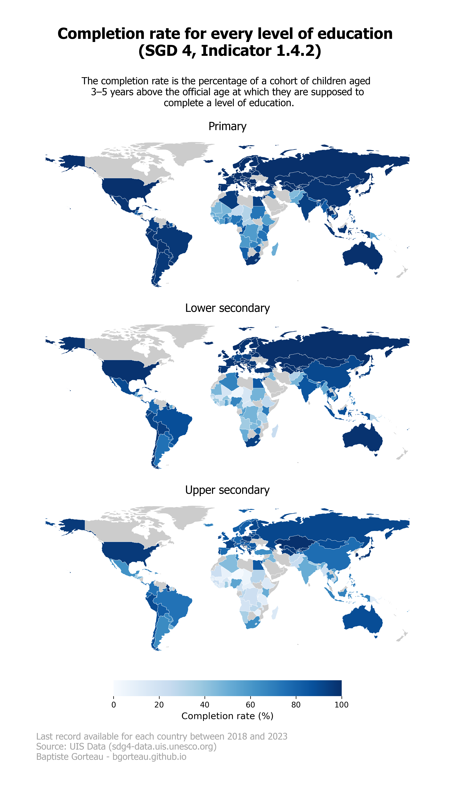
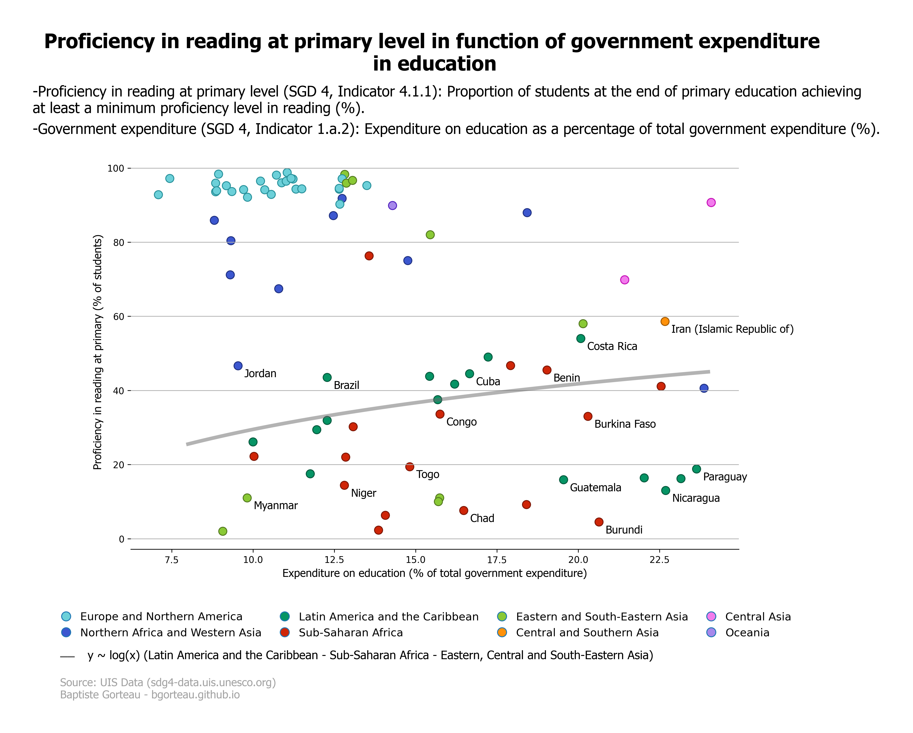
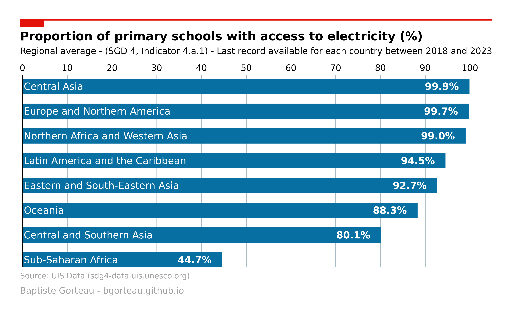

# Create representations from UIS data
---

From February 7 to 9, 2024, the UNESCO Institute for Statistics ([UIS](https://uis.unesco.org/)) held its first [Conference on Education Data and Statistics](https://ces.uis.unesco.org/) in Paris. During the conference, discussions were held on the various aspects of Sustainable Development Goals indicators 4 ([SDG 4](https://sdgs.un.org/goals/goal4)). These indicators concern different aspects of education, and their descriptions are available [here](https://www.education-progress.org/en/indicators). Thanks to the SDG 4 data available at the following link: http://sdg4-data.uis.unesco.org/, we have produced three representations highlighting the importance of these indicators for a better understanding of education issues in our world.

## The completion rate for every level of education
   
  
  
## The proficiency in reading in function of government expenditure in education
   
  
  
## Primary schools with acces to electricity
   
  

---

In this notebook, we show the Python code that enabled us to obtain these representations.
